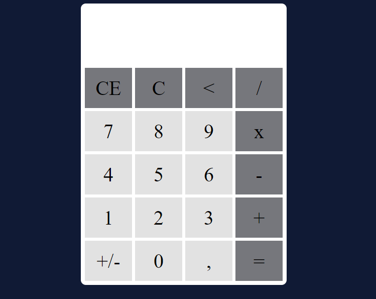

# Calculadora

Este projeto é o básico para quem começa a programar: Uma calculadora. Tentei abranger todas as partes de uma calculadora básica e agregar um layout visual acessível utilizando uma paleta de cores mais escuras. 

Com ele eu busquei acrescentar aos meus conhecimentos a lógica de programação e astechs: JavaScript, HTML, CSS.

Fiz ela responsiva para poder ser utilizada em aparelhos celulares com telas menores. 

OBS: A partir deste projeto passei a codar utilizando inglês nas funcões, variáveis, etc. 

🖱️ [Calculadora](https://calculadorabysamir.netlify.app/)

<a href="https://calculadorabysamir.netlify.app/"> </img> </a>
